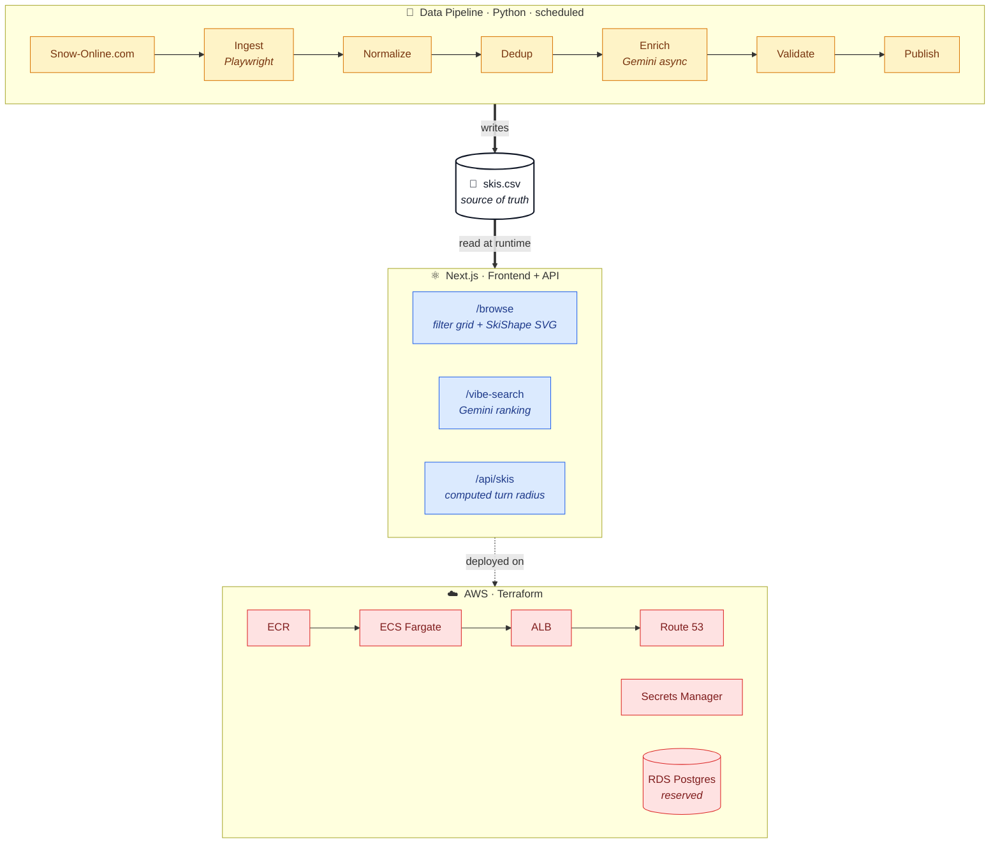
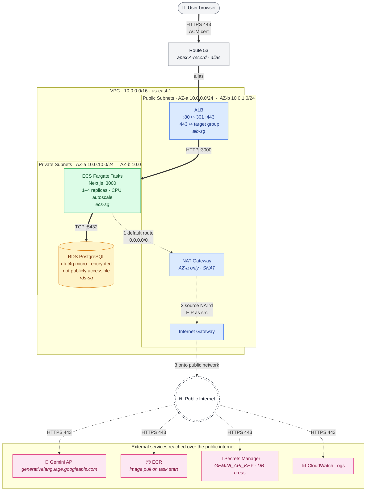

# Building IceCore: An AI-Powered Ski Discovery Platform

*A retrospective on the architecture, pipeline, and cloud infrastructure behind a side project that turned a CSV of ski specs into something genuinely useful.*

---

## Why IceCore Exists

Every fall, the same thing happens. You walk into a ski shop, point at a wall of 200 skis, and ask: "I'm 5'10", 175 lbs, intermediate, I like cruising groomers but want to start playing in trees — what do I buy?" The shop guy gives you a great answer. Then you go home, doom-scroll review sites for three weeks, get more confused, and eventually buy whatever your friend has.

The information *exists* — every ski's tip/waist/tail dimensions, turn radius, year, brand, intended use case. It's just scattered across hundreds of manufacturer pages, sized for marketing rather than decision-making, and impossible to compare side-by-side. **IceCore** is a small attempt to fix that: a single searchable database of 1,776 skis from 17 brands, enriched with AI-generated personality summaries, and queryable by natural-language "vibe."

This post walks through how it's built — the data pipeline, the web app, the LLM glue, and the AWS infrastructure — and what I'd change next time.

---

## Architecture at a Glance

IceCore has three roughly orthogonal layers. The pipeline is a Python batch job that scrapes and enriches data. The web app is a Next.js frontend with thin API routes. The infrastructure is a Terraform stack on AWS. The seam between them is deliberately boring: a single canonical CSV.



The decision to keep the runtime data layer as a flat CSV instead of a database was load-bearing. It means the frontend has zero query latency (everything is in-memory at boot), the pipeline has no live coupling to the app, and the entire dataset fits comfortably in a Git diff for review. RDS is provisioned but not yet wired in — it's there for when user accounts, saved searches, or analytics arrive.

---

## The Data Pipeline

The pipeline lives in `scripts/pipeline/` and runs as a six-stage Python job:

1. **Ingest** (`snowonline.py`) — Playwright drives a headless Chromium against snow-online.com. It handles dynamic content, Cloudflare challenges (request-first, browser-first fallback, exponential backoff), and writes a dead-letter queue for pages that fail repeatedly. Each ski yields model name, brand prefix, year, tip/waist/tail in millimeters, available lengths, and a source link.
2. **Normalize** (`normalize.py`) — Parses brand from model name, coerces year values, validates numeric fields. The boring but load-bearing stage.
3. **Dedup** (`dedup.py`) — Fuzzy string matching with configurable thresholds. Multi-year SKUs and regional naming differences turn a dataset of "1,800 skis" into 1,500 actual unique models if you're not careful.
4. **Enrich** (`enrich.py`) — Async Gemini 2.0 Flash calls behind a 5-way semaphore, rate-limited to 15 RPM (Gemini's free-tier ceiling). Each call generates a 2-3 sentence "vibe summary" plus search tags (`#PowderSurfing`, `#Carving`) and recommended terrain.
5. **Validate** (`validate.py`) — Quality gate on numeric ranges and missing fields. Writes `quality_issues.json`. Run fails if error rate exceeds threshold.
6. **Publish** (`publish.py`) — Writes `icecore-app/data/skis.csv` and `skis.meta.json` (timestamp, counts, freshness).

The whole thing is packaged in `Dockerfile.pipeline` (Python 3.12-slim + Chromium) and is designed to run as a scheduled Fargate task triggered by EventBridge. The current cadence is "whenever I remember" — Phase 3 on the roadmap turns this into a proper crawler platform with a task queue and monitoring.

The interesting design choice here was making each stage idempotent and resumable. Ingest is the slow stage (Playwright + anti-bot dance), so it checkpoints every page. Re-running the pipeline never re-scrapes pages that already succeeded.

---

## The Web App

`icecore-app/` is Next.js 16 (App Router) with React 19, Tailwind v4, shadcn/ui components, and TypeScript everywhere. The dependency tree is intentionally small — no state management library, no ORM, no component framework beyond shadcn primitives.

### `/browse` — the catalog

A filterable grid of every ski in the database. Each card shows the model, brand, year, dimensions, AI vibe summary, and a `<SkiShape>` SVG that draws the *actual* sidecut profile to scale using the tip/waist/tail values. It's a small thing, but seeing a 95mm-waist all-mountain ski next to a 110mm freeride ski at the same scale tells you more in a glance than any spec table.

The turn radius isn't stored — it's computed on the fly from sidecut geometry in `lib/data.ts`:

```
R ≈ L_eff² / (4 × sidecut_depth)
```

with the effective edge factor varying by waist width: 0.92 for narrow carving skis (<75mm), 0.88 for all-mountain (75–95mm), 0.82 for fat freeride (>95mm). This sort of computed-on-read property is exactly what makes the CSV-as-source-of-truth approach pleasant — the formula lives next to the rendering code, not in a migration.

### `/vibe-search` — the LLM front

The form takes height, weight, ability level, optional gender, and a free-text "vibe" ("aggressive carver who wants to start playing in trees"). The handler (`/api/vibe-search`):

1. Pre-filters candidates by inferred waist-width category (parsed from vibe keywords).
2. Filters by length range derived from height and ability level.
3. Shuffles down to ~30 candidates that fit Gemini's context window.
4. Sends a structured prompt asking Gemini 2.0 Flash to return the top 3 with explanations and a recommended length.
5. Parses the JSON response and renders.

The pre-filter is deliberate. Sending 1,700 candidates to a model and asking it to rank them is both expensive and worse than letting deterministic filters narrow the field first. Gemini's job is to apply taste to a curated shortlist, not to do bulk retrieval. Vector search and similarity recommendations are on the Phase 4 roadmap; for now, keyword-and-rules filtering plus an LLM ranker is sufficient and cheap.

---

## The Cloud Infrastructure

The Terraform stack in `terraform/` provisions 31 resources. The shape is conventional — VPC with public/private subnets across two AZs, ALB out front, ECS Fargate behind it, ECR for images, Secrets Manager for the Gemini key, RDS Postgres reserved for future use, Route 53 for the custom domain.

### Network Topology



**Security-group chain:** `0.0.0.0/0` ──80/443──► `alb-sg` ──3000──► `ecs-sg` ──5432──► `rds-sg`

A few things to note from the topology that aren't obvious from the listing alone:

- **Nothing in the private subnets has a public IP.** ECS tasks reach Gemini, ECR, Secrets Manager, and CloudWatch through the single NAT Gateway in AZ-a. That NAT is also the project's biggest single line item (~$32/month) and the one piece of the stack that doesn't scale to zero. A fuller setup would add VPC endpoints for ECR / Secrets Manager / Logs to take them off the NAT path; I didn't bother because traffic is tiny.
- **One NAT Gateway, not two.** Best-practice multi-AZ would put a NAT in each public subnet so an AZ outage doesn't sever egress for tasks in the other AZ. For a side project, the cost (~$32/month per NAT) wasn't worth the resilience.
- **The ALB has both an HTTP and HTTPS listener.** Port 80 issues a 301 redirect to 443; port 443 terminates TLS using the ACM cert and forwards plain HTTP on port 3000 to ECS over the VPC's private network. The cert itself is validated via Route 53 DNS records, which Terraform manages end-to-end.
- **Security groups form a chain, not a mesh.** The ALB SG accepts 80/443 from the world. The ECS SG accepts 3000 only from the ALB SG. The RDS SG accepts 5432 only from the ECS SG. Nothing in the VPC is reachable from the internet except port 80/443 on the ALB.
- **Both RDS and Gemini secrets live in Secrets Manager.** The ECS task execution role has a tightly scoped policy granting `GetSecretValue` on exactly those two ARNs (plus `kms:Decrypt` for the SM-managed CMK). Secret values land in the container as env vars at task start; they never touch the image, the registry, or the Terraform state in plaintext.

### A few decisions worth calling out

**Secrets injection over env files.** `GEMINI_API_KEY` lives in AWS Secrets Manager (`icecore/gemini-api-key`). The ECS task definition references it via ARN; the container sees it as a normal env var at runtime. No `.env` files touch the build or the registry. The Terraform module conditionally creates the secret if no ARN is supplied, so a fresh `terraform apply` in a new account works without prep.

**Fargate over EC2.** The web app is a single Next.js process that needs ~150MB of RAM. Paying $63/month for a Fargate-backed setup (ECS + NAT + ALB) is more than it would cost on a single t4g.nano, but the operational delta — no AMIs, no patching, no SSH, scaling is one Terraform variable — is worth it for a side project I want to *not* think about.

**ALB-and-Route 53 over CloudFront.** No edge caching yet. The dataset is small enough that origin response times are fast, and adding CloudFront mostly buys complexity at this scale. When traffic justifies it, the ALB is already a clean origin.

**Auto-scaling on CPU, not request count.** Target tracking against 70% CPU, 1–4 tasks. CPU correlates well with the workload (most requests are CSV scans + an outbound Gemini call), and request-count tracking would over-provision during the LLM-bound tail.

**RDS provisioned but not wired in.** db.t4g.micro, 20–100 GB, 7-day backups, deletion protection on. It's there because future features (saved searches, user-submitted data, scrape audit logs) want a real database, and adding RDS to a running Terraform stack later is more painful than adding it now and not connecting to it.

The `Dockerfile.pipeline` and the web app's `Dockerfile` are both multi-stage. The web image lands at ~140MB. Deploys are: build → tag → push to ECR → `aws ecs update-service --force-new-deployment`. There's a small skill in the repo that automates this and prevents the `:v3`/`:latest` tag confusion that bit me twice early on.

---

## What I'd Do Differently

A few things I'd rethink with hindsight:

- **Start with the canonical schema, not the scraper.** I changed the CSV column shape three times early on, and each one rippled into the frontend. A schema-first approach (or even a Pydantic model that the pipeline emits and the app validates against) would have prevented a lot of churn.
- **Split the LLM enrichment from the scraper.** Right now they're stages in the same pipeline. Re-enriching with a new prompt requires re-running everything downstream of ingest. Splitting them into two independent jobs that share a CSV would have been cleaner.
- **Add observability earlier.** The pipeline logs to stdout and the dead-letter queue. That's enough until it isn't. CloudWatch metrics on stage durations, Gemini error rates, and dataset deltas would have caught a Cloudflare-induced regression I only noticed when the homepage stat counter dropped.

---

## Calling It

I'm shelving IceCore. Not because anything is broken — the pipeline runs, the site is up, the recommendations are decent — but because the honest version of the roadmap is: the next mile of work is *data*, not *engineering*. More brands, more sources, price aggregation, review scraping, anti-bot games at scale. None of that is a fun side project. It's an operations job, and the marginal user value over the current 1,776-ski dataset is genuinely small for someone who just wants to buy one pair of skis.

The infrastructure will keep running until the AWS bill annoys me into a `terraform destroy`. The repo stays public. If the urge ever returns — or if someone wants to fork it and actually go after the crawler-platform phase — the seams are clean enough that picking it up shouldn't hurt.

What I take away from this one is mostly the architectural shape, not the product. The CSV-as-source-of-truth pattern, the Terraform stack tuned for a single small service, the LLM-as-ranker-not-retriever split — those are templates I'll reuse on the next thing. Side projects are partly a way to ship a real product and partly a way to develop muscles. This was more of the second than I expected, and that's fine.

The skis aren't going anywhere. Neither am I. We'll see each other again in November.

---

*IceCore is on hold as of April 2026. The stack: Next.js · TypeScript · Tailwind · shadcn/ui · Python · Playwright · Pandas · Google Gemini 2.0 Flash · Docker · Terraform · AWS (ECS Fargate, ALB, ECR, Secrets Manager, RDS, Route 53). Source dataset: snow-online.com.*
